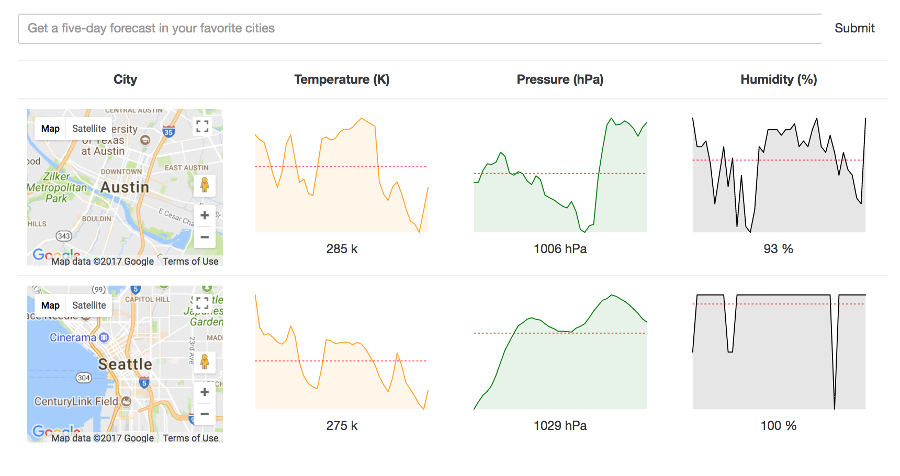

# Weather App

This is a simple weather app built using React and Redux. Weather data is pulled from the OpenWeatherMap API, and users can search for specific cities. A simple chart and Google Map are displayed for each selected city.

## Getting Started

* Clone the repository
* Install dependencies by running `npm i`
* Run app with `npm start`
* View app in browser at http://localhost:8080

## Resources

This app was created as part of a [Udemy tutorial](https://www.udemy.com/react-redux/). The boilerplate for this project is [here](https://github.com/StephenGrider/ReduxSimpleStarter.git).
